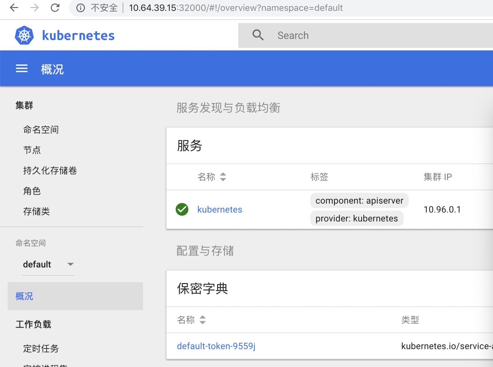

kubernetes dashboard 官方原版默认开启的https 及认证，在个人环境或者私有环境中可以使用http及关闭认证，方便登陆。

文本介绍修改dashboard yaml 方法，在 1.9 以及1.10验证通过。

https://raw.githubusercontent.com/kubernetes/dashboard/master/src/deploy/recommended/kubernetes-dashboard.yaml

k8s.gcr.io/kubernetes-dashboard-amd64:v1.10.0=registry.cn-hangzhou.aliyuncs.com/google_containers/kubernetes-dashboard-amd64:v1.10.0

yaml 文件中镜像地址可以换成阿里的，下载起来嗖嗖的

## 修改deployment

需要改两处 

1. port 增加 9090， 原本镜像中就是有9090 非安全端口的，只是yaml文件没有暴露出来

2. args 下面 ‘- --auto-generate-certificates’ 注释掉， 前面添加 # 

```bash
    spec:
      containers:
      - name: kubernetes-dashboard
        image: k8s.gcr.io/kubernetes-dashboard-amd64:v1.10.0
        ports:
        - containerPort: 8443
          protocol: TCP
          name: https
        - containerPort: 9090
          protocol: TCP
          name: http
        args:
          # - --auto-generate-certificates
          # Uncomment the following line to manually specify Kubernetes API server Host
          # If not specified, Dashboard will attempt to auto discover the API server and connect
          # to it. Uncomment only if the default does not work.
          # - --apiserver-host=http://my-address:port
```

## 修改service

1. 增加端口，target指向9090

2. 配置nodeport，方便通过节点ip+nodeport 访问，即输入 k8s节点ip：32000 就可以访问到dashboard

注意记得添加 ‘  type: NodePort’

```bash
kind: Service
apiVersion: v1
metadata:
  labels:
    k8s-app: kubernetes-dashboard
  name: kubernetes-dashboard
  namespace: kube-system
spec:
  ports:
    - port: 443
      targetPort: 8443
      nodePort: 32001
      name: https
    - port: 80
      targetPort: 9090
      nodePort: 32000
      name: http
  type: NodePort

  selector:
    k8s-app: kubernetes-dashboard
```

## 通过yaml文件创建

`kubectl  create -f kubernetes-dashboard.yaml `

修改后的文件存在我的git

https://raw.githubusercontent.com/cai11745/k8s-ocp-yaml/master/yaml-file/kubernetes-dashboard.yaml

## 访问测试

通过节点ip：32000 访问

 

