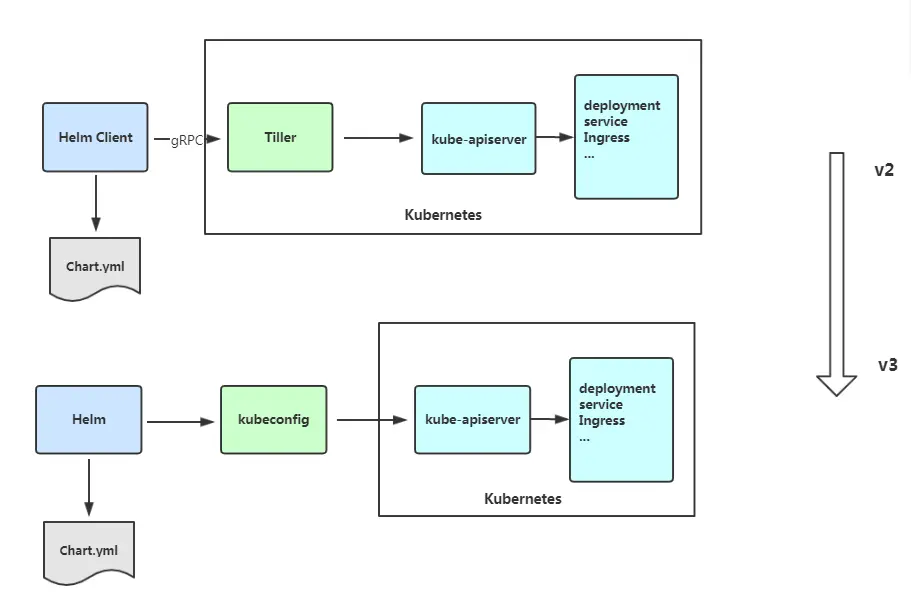

### Helm用途

Helm把Kubernetes资源(比如deployments、services或 ingress等) 打包到一个chart中，而chart被保存到chart仓库。  
通过chart仓库可用来存储和分享chart。  
Helm使发布可配置参数，支持发布应用配置的版本管理，简化了Kubernetes部署应用的版本控制、打包、发布、删除、更新等操作。

**可以简单理解为： 应用商店**

### helm3 变化

helm3 与helm2的变动很大，主要有几处  

#### 1. 去除Tiller 和 helm serve
现在helm命令通过kubeconfig 直接操作k8s集群，类似于kubectl  
Helm使用与kubectl上下文相同的访问权限，也无需再使用helm init来初始化Helm  
这点在helm部署和使用上方便了很多，也减少了服务发布可能遇到的因为tiller引起的异常



而且移除了 helm serve 的功能，不再

#### 2. 预定义仓库被移除，添加helm hub  
helm search 现在区分 repo 和hub  
repo 是自己手动添加的源  
比如官方的有稳定版和在建设的，还有ibm的
```bash
helm repo add stable https://kubernetes-charts.storage.googleapis.com
helm repo add incubator https://kubernetes-charts-incubator.storage.googleapis.com/
helm repo add ibmstable https://raw.githubusercontent.com/IBM/charts/master/repo/stable
# 此处 repo add 的时候，如果名称已存在了也不提醒，居然直接覆盖了，是bug吧
```

hub 是 helm 的中心库，各软件商需要在 hub 把应用更新到最新，我们才能在上面查到最新的，同dockerhub

这个建设还不久，好处是范围比较广泛, hub 搜到的包需要进入hub页面查看下载地址

我们可以把 hub 和 google repo 配合起来食用，效果更佳  

`helm search hub mysql`

#### 3. Values 支持 JSON Schema 校验器

当我们运行 helm install 、 helm upgrade 、 helm lint 、 helm template 命令时，JSON Schema 的校验会自动运行，如果失败就会立即报错。

这样等于是先都校验了一遍，再创建。 kubectl 说你呢，能不能学学！！！

我测试了一下  
```bash
helm pull stable/mysql
tar -zxvf mysql-1.6.2.tgz 
cd mysql 
vim values.yaml 
# 把port: 3306 改成 port: 3306aaa
# 安装测试，会校验port的格式，而且确实是在安装之前，一旦有错任何资源都不会被创建
helm install mysqlll .
Error: unable to build kubernetes objects from release manifest: error validating "": error validating data: ValidationError(Service.spec.ports[0].port): invalid type for io.k8s.api.core.v1.ServicePort.port: got "string", expected "integer"
```

#### 4. 代码复用 - Library Chart 支持
Helm 3 中引入了一种新的 Chart 类型，名为 Library Chart 。它不会部署出一些具体的资源，只能被其他的 Chart 所引用，提高代码的可用复用性。当一个 Chart 想要使用该 Library Chart内的一些模板时，可以在 Chart.yaml 的 dependencies 依赖项中指定。

#### 5. requirements.yaml 被整合到了 Chart.yaml 中，但格式保持不变

还有一些其他的功能，比如 helm test 等，不属于主要功能，且属于测试阶段，我还没有去尝试。

### helm2/3 命令差异
本节命令差异部分摘自 https://blog.csdn.net/liumiaocn/article/details/103380446  
作者： liumiaocn

Helm 2和Helm 3在使用上还是有些区别的，除了在Helm 3中移除了Tiller，一些常用的命令也发生了变化，在这篇文章中进行简单的整理。

#### 常用命令一览
|命令|	Helm 2|	Helm 3|	命令说明区别|	命令说明|
|-|-|-|-|-|
|create|	有|	有|	无|	create a new chart with the given name|
|delete|	有|	无|	-|	given a release name, delete the release from Kubernetes|
|dependency|	有|	有|	无|	manage a chart’s dependencies|
|fetch|	有|	无|	-|	download a chart from a repository and (optionally) unpack it in local directory|
|get|	有|	有|	有|	download a named release|
|history|	有|	有|	无|	fetch release history|
|home|	有|	无|	-|	displays the location of HELM_HOME|
|init|	有|	无|	-|	initialize Helm on both client and server|
|inspect|	有|	无|	-|	inspect a chart|
|install|	有|	有|	有|	install a chart archive|
|lint|	有|	有|	无|	examines a chart for possible issues|
|list|	有|	有|	无|	list releases|
|package|	有|	有|	无|	package a chart directory into a chart archive|
|plugin|	有|	有|	有|	add, list, or remove Helm plugins|
|repo|	有|	有|	无|	add, list, remove, update, and index chart repositories|
|reset|	有|	无|	-|	uninstalls Tiller from a cluster|
|rollback|	有|	有|	无|	roll back a release to a previous revision|
|search|	有|	有|	无|	search for a keyword in charts|
|serve|	有|	无|	-|	start a local http web server|
|status|	有|	有|	无|	displays the status of the named release|
|template|	有|	有|	无|	locally render templates|
|test|	有|	有|	有|	test a release|
|upgrade|	有|	有|	无|	upgrade a release|
|verify|	有|	有|	无|	verify that a chart at the given path has been signed and is valid|
|version|	有|	有|	有|	print the client/server version information|
|env|	无|	有|	-|	Helm client environment information|
|help|	无|	有|	-| Help about any command|
|pull|	无|	有|	-|	download a chart from a repository and (optionally) unpack it in local directory|
|show|	无|	有|	-|	show information of a chart|
|uninstall|	无|	有|	-|	uninstall a release|

#### Helm3: 不再存在的Helm2的命令

在前面的文章示例中，我们发现helm init已经在Helm 3中不存在了。类似的共有如下7条命令，在Helm 3中或删除或改名或则功能增强，比如因为Tiller的去除，所以导致了reset命令没有存在的意义，同时init存在仅剩客户端需要设定的功能，所以被去除了。另外诸如fetch命令，而在Helm 3中提供了pull命令予以替代。本来home命令用于显示HELM_HOME环境变量，而在Helm 3中提供env命令可以显示所有的环境变量信息，用增强的功能予以了替换。但是无论如何，总之已经无法在Helm 3中直接使用如下7条命令。

|命令|	Helm 2|	Helm 3|	命令说明|
|-|-|-|-|
|delete|	有|	无|	given a release name, delete the release from Kubernetes|
|fetch|	有|	无|	download a chart from a repository and (optionally) unpack it in local directory|
|home|	有|	无|	displays the location of HELM_HOME|
|init|	有|	无|	initialize Helm on both client and server|
|inspect|	有|	无|	inspect a chart|
|reset|	有|	无|	uninstalls Tiller from a cluster|
|serve|	有|	无|	start a local http web server|

#### Helm3: 相较与Helm2新增的命令
相较于Helm 2，从helm --help中获得的信息看到如下5条命令在Helm 3中为新增的命令。

|命令|	Helm 2|	Helm 3|	命令说明|
|-|-|-|-|
|env|	无|	有|	Helm client environment information|
|help|	无|	有|	Help about any command|
|pull|	无|	有|	download a chart from a repository and (optionally) unpack it in local directory|
|show|	无|	有|	show information of a chart|
|uninstall|	无|	有|	uninstall a release|

稍作分析，会发现如下事实：

env是对被删除的命令home的强化  
pull是对被删除的命令fetch的替换  
show是对被删除的命令inspect的替换  
help命令本身在Helm 2时代就可以使用，只是helm --help里面没有显示，算是文档自包含的强化  
uninstall是功能特性的增强  

#### Helm3: 命令说明发生变化
由于Tiller的移除，版本显示命令helm version的表述从显示client/server的版本信息变成了显示client的版本信息，类似的发生变化的共有5条命令，到底是文档的变化还是功能性的反映，在后续的文章中将继续通过实例进行进一步的说明。

|命令|	Helm 2|	Helm 3|	命令说明区别|	Helm2命令说明|	Helm3命令说明|
|-|-|-|-|-|-|
|get|	有|	有|	有|	download a named release	download extended information of a named release|
|install|	有|	有|	有|	install a chart archive	install a chart|
|plugin|	有|	有|	有|	add, list, or remove Helm plugins	install, list, or uninstall Helm plugins|
|test|	有|	有|	有|	test a release	run tests for a release|
|version|	有|	有|	有|	print the client/server version information	print the client version information|

#### Helm3: 其他变化
并不是说helm --help没有变化的，使用上就没有区别，以repo和install为例，在使用上都发生了变化，但是在helm自身提供的帮助信息中却未提供，这些也会在后续的示例的使用中进一步进行说明。

### 结尾
helm3 新加的命令基本都是对helm2命令的强化，不再做一个个测试了。

附 helm2 的学习笔记。

https://github.com/cai11745/k8s-ocp-yaml/blob/master/kubernetes-docs/2018-05-02-install-helm.md

### 安装 mysql 
试下mysql，并使用持久化存储。

获取chart

```bash
helm repo add stable https://kubernetes-charts.storage.googleapis.com
helm search repo mysql
# 稳定版库里面找到了mysql5.7，正是所需要的，下载下来
helm pull stable/mysql
tar -zxvf mysql-1.6.2.tgz 

# 查看 valume 说明，persistence 默认已经是enable
# 没有使用storageclass，直接安装
helm install mysql123 .

# 查看pod 和pvc，都是Pending，缺少pv
建一个hostpath的pv
vim /tmp/mysql-pv.yaml 

kind: PersistentVolume
apiVersion: v1
metadata:
  name: mysql-data
  labels:
    release: stable
spec:
  capacity:
    storage: 10Gi
  accessModes:
    - ReadWriteOnce
  hostPath:
    path: /tmp/mysql-data

kubectl create -f /tmp/mysql-pv.yaml 

kubectl get po                             
NAME                       READY   STATUS    RESTARTS   AGE
mysql123-b86d7c687-9795n   1/1     Running   0          35s
```

### 参考文档
https://developer.ibm.com/technologies/containers/blogs/kubernetes-helm-3/  
https://juejin.im/post/5dd35990f265da0be72aafb4  
https://blog.csdn.net/liumiaocn/article/details/103380446  
https://my.oschina.net/u/3330830/blog/3157558  

