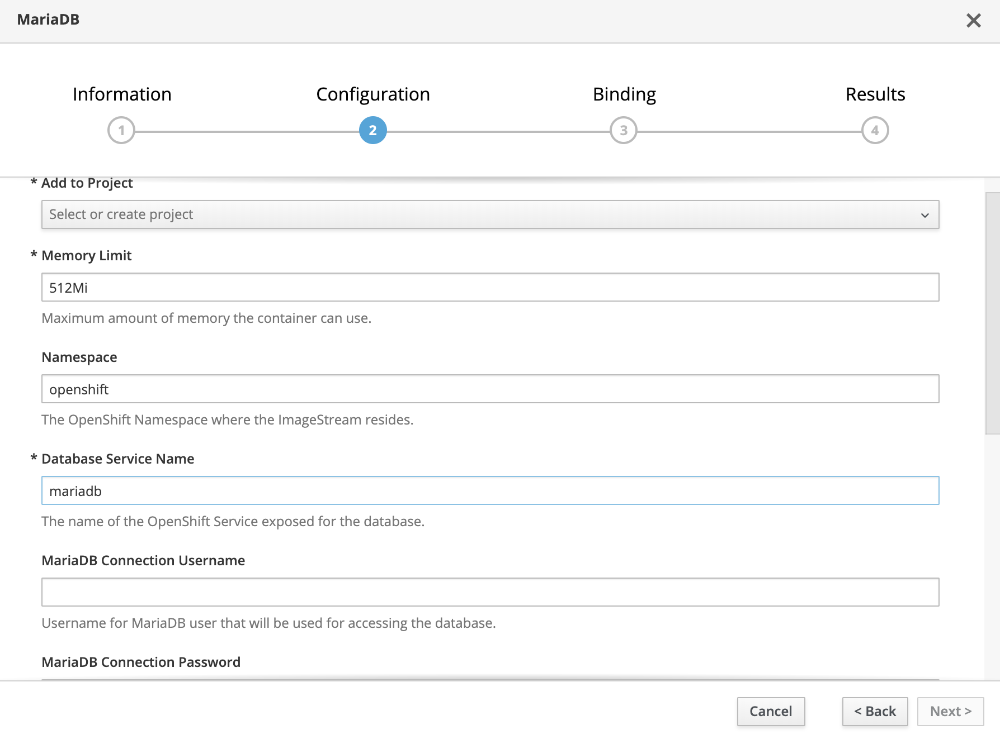
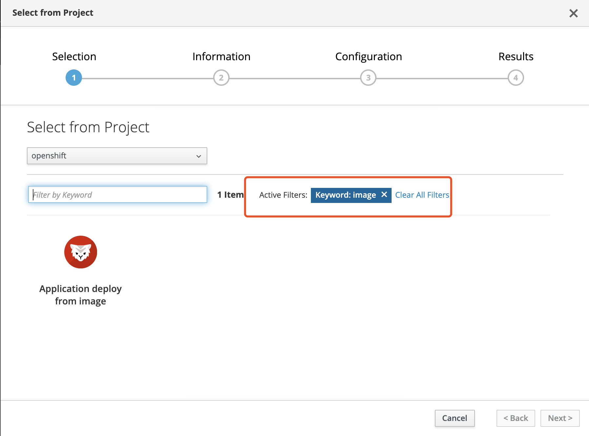
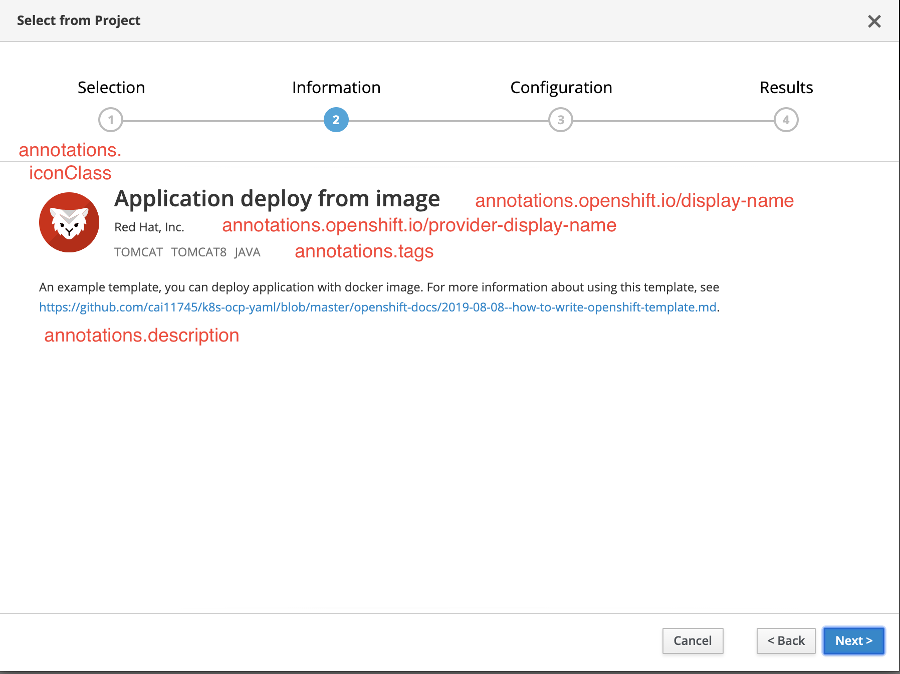
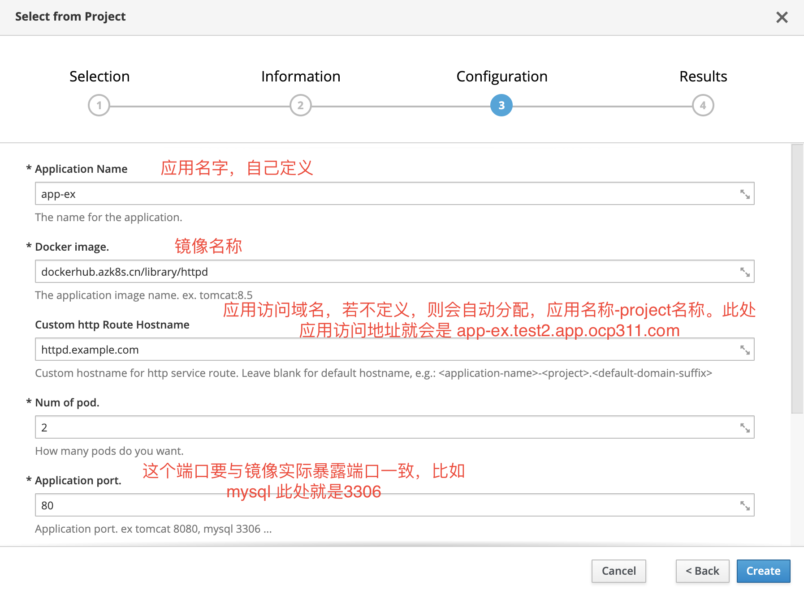
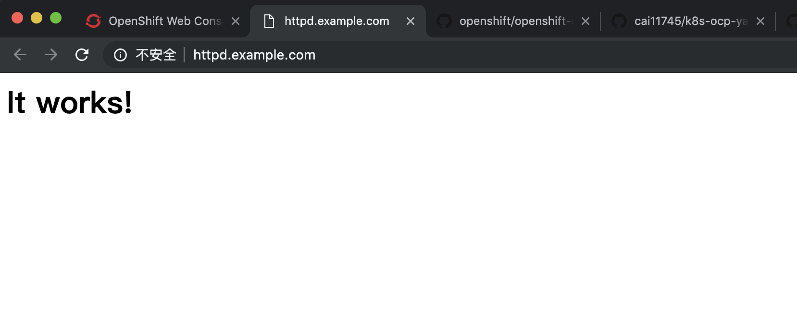
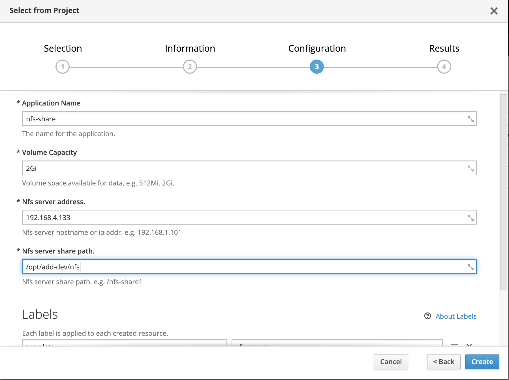
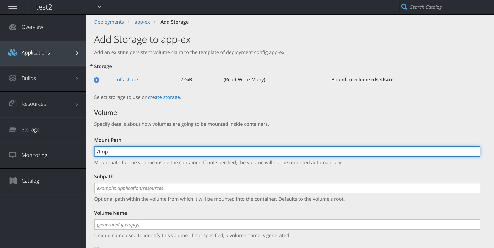
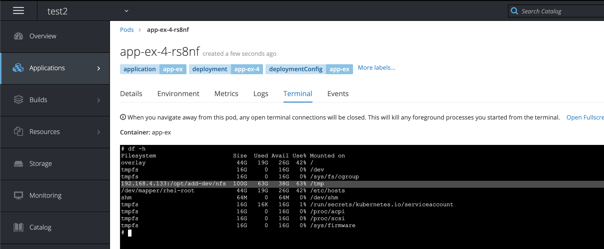

#### 什么是 template 及他的用途 
template 是一些资源的组合，资源是指 openshift中 应用、存储、服务暴露、密钥，即deploymentconfig，pv/pvc，service，route，secret，imagestream，configmap等。   
并可以将应用名、镜像名、数据库地址、密码、环境地址等可变参数通过页面发布时候传递进去。  
即通过可视化页面实现了中间件、微服务、数据库等应用快速发布。可以理解为应用商店的一种。

这是发布时选择template的页面
 
例如，这是mariadb配置参数页面
 

openshift 已经提供了一些开箱即用的template，包含了 jboss,openjdk,nginx,php,mysql,mongo,postgres,mariadb...（openshift企业版）  
因为上面有些中间件是红帽的企业版，所以openshift社区版不包含（比如jboss,amq），template总数会少一些，不过这都没关系，看完这篇我们可以自己做哈。  
这些template位于一个名称为openshift的project下。 
#### 以下通过几个使用template的场景，由简入难，演示如何创建及使用template，template内容解读。
1. 通过已有docker镜像发布应用，包含deploymentconfig，service，route
2. 制作基于nfs 的pv pvc持久化存储模板，通过模板发布pv pvc，并可以将他挂载到第一步发布的应用
3. 通过openshift s2i，实现源码编译自动发布springlcoud微服务应用
4. 将helm中应用的转化为template

### 场景一 通过已有docker镜像发布应用
已经制作好了应用镜像，通过openshift web 页面实现发布，并能够访问
如果你想做一个属于自己的template，建议基于现有模板来修改  
#### 获取template文件及内容解读
获取template文件，这是我写好的例子，以下通过这个栗子说明template的组成及用法
```bash
wget https://raw.githubusercontent.com/cai11745/k8s-ocp-yaml/master/yaml-file/template-openshift/deploy-from-image.yaml

```

template 文件可以理解为三大块组成  
1. object往上是这个模板的定义参数，比如名称，提示信息，注释等。
2. object 到 parameters 是自定义的资源，可以是deployment，service，configmap，secret，pv等，任何你想通过模板快速创建的资源。 并将其中可变参数摘出来，通过页面输入进去。 注意若变量是非字符串，如应用端口，副本数、base64，需使用双大括号。  
object中的资源建议使用相同的标签。
3. parameters，需要动态灵活配置的参数，摘出来，通过页面配置，再传递到上面的各种资源中。 需要注意若value配置默认端口需双引号。

```bash
[root@master template-openshift]# cat deploy-from-image.yaml 
apiVersion: template.openshift.io/v1
kind: Template
labels:
  template: application-deploy-from-image
message: Your application has been created in your project.
  The route addr is ${HOSTNAME_HTTP}  # 应用发布完成后的提示信息，可以用来写应用访问地址，数据库的访问信息之类，建议完善。
metadata:
  annotations: # annotations 里面的都是非必备项
    description: An example template, you can deploy application with docker image. For more information about
      using this template, see https://github.com/cai11745/k8s-ocp-yaml/blob/master/openshift-docs/2019-08-08--how-to-write-openshift-template.md. # template 被选中时候的初始描述
    iconClass: icon-rh-tomcat  # 模板的图标，库在这 https://rawgit.com/openshift/openshift-logos-icon/master/demo.html
    openshift.io/display-name: Application deploy from image  # 如果设置了这项，这个template在web上显示的名称是这个，不再是metadata.name内容
    openshift.io/provider-display-name: Red Hat, Inc.  #自定义，展示在发布页
    tags: tomcat,tomcat8,java # 自定义，会展示在发布页面，非必备项。需要注意如果带有hide字段,则不在web页面展示
    template.openshift.io/support-url: https://github.com/cai11745/k8s-ocp-yaml/blob/master/openshift-docs/2019-08-08--how-to-write-openshift-template.md
  name: deploy-from-image
objects:  # 以下为资源集合，可以添加各种支持的资源类型，每-apiVersion 就是一个，可以是dc，configmap，imagestream等
- apiVersion: v1
  kind: Service
  metadata:
    annotations:
      description: The web server's http port.
    labels:
      application: ${APPLICATION_NAME}
    name: ${APPLICATION_NAME}
  spec:
    ports:
    - port: ${{APPLICATION_PORT}}   # 注意此处若采用变量，需双大括号。双大括号可以把'parameters'传递参数中的双引号去掉。
      targetPort: ${{APPLICATION_PORT}}   # 注意此处若采用变量，需双大括号
    selector:
      deploymentConfig: ${APPLICATION_NAME}
- apiVersion: v1
  id: ${APPLICATION_NAME}-http
  kind: Route
  metadata:
    annotations:
      description: Route for application's http service.
    labels:
      application: ${APPLICATION_NAME}
    name: ${APPLICATION_NAME}
  spec:
    host: ${HOSTNAME_HTTP}
    to:
      name: ${APPLICATION_NAME}
- apiVersion: v1
  kind: DeploymentConfig
  metadata:
    labels:
      application: ${APPLICATION_NAME}
    name: ${APPLICATION_NAME}
  spec:
    replicas: ${APPLICATION_REPLICAS}  # 注意此处若采用变量，需双大括号
    selector:
      deploymentConfig: ${APPLICATION_NAME}
    strategy:
      type: Recreate
    template:
      metadata:
        labels:
          application: ${APPLICATION_NAME}
          deploymentConfig: ${APPLICATION_NAME}
        name: ${APPLICATION_NAME}
      spec:
        containers:
        - image: ${APPLICATION_IMAGE}  
          name: ${APPLICATION_NAME}
          ports:
          - containerPort: ${{APPLICATION_PORT}}  # 注意此处若采用变量，需双大括号
            name: http
            protocol: TCP
    triggers:
    - type: ConfigChange
parameters:  #以下信息将显示在web页面，通过页面把参数传递到上面的object中。
- description: The name for the application.
  displayName: Application Name
  name: APPLICATION_NAME   #对应上面object里调用的变量，把值传递上去。
  required: true   #表示必填项
  value: app   #默认值
- description: The application image name. ex. tomcat:8.5
  displayName: Docker image.
  name: APPLICATION_IMAGE
  required: true
  value: dockerhub.azk8s.cn/library/tomcat:9.0   #默认镜像，可以换成其他任意想发布的服务，记得下面的端口需要同步修改。
- description: 'Custom hostname for http service route.  Leave blank for default hostname,
    e.g.: <application-name>-<project>.<default-domain-suffix>'
  displayName: Custom http Route Hostname
  name: HOSTNAME_HTTP
- description: How many pods do you want.
  displayName: Num of pod.
  name: APPLICATION_REPLICAS
  required: true
  value: "1"  #此处需双引号。上面调用的时候再用双大括号去掉引号。
- description: Application port. ex tomcat 8080, mysql 3306 ...
  displayName: Application port.
  name: APPLICATION_PORT
  required: true
  value: "8080"

```

#### 导入template
把他发布到 openshift peoject，此 project 下的 template 所有用户都具备访问权限。
```bash
# oc -n openshift create -f deploy-from-image.yaml
template.template.openshift.io/deploy-from-image created

```

#### 通过 template 发布服务
在web页面选择 "Add to Projtct" -> "Select from Project"
 

会出现选择 template 页面，选 openshift project，因为上一步我们把 template 导入到了这个 project 下。内容比较多，我们通过关键词 image 检索下，注意此处显示的名称是 metadata.annotations.openshift.io/display-name 而不是 metadata.name
 

这页显示的是 template 介绍信息，都是yaml文件中 metadata.annotations 部分的内容
 

发布服务，名字自己定义，镜像用自己仓库的或者公网的，这里换成httpd，注意下面端口也要改成相应的。
 

发布成功后，页面会显示 template yaml 文件中 message 部分定义的内容。

如果容器启动异常，日志显示权限原因报错，改下权限
```bash
oc project xxxx
oc adm policy del-scc-to-user anyuid -z default
oc rollout cancel dc app-ex  #取消之前的发布
oc rollout latest app-ex  #重新发布
```

#### 访问测试
通过域名方式访问应用，测试场景下一般不会把域名解析去写入dns server。 我们可以通过修改本地hosts文件方式解析
首先查看 default project 下 router 应用的 ip
```bash
[root@master template-openshift]# oc -n default get po -owide
NAME                       READY     STATUS    RESTARTS   AGE       IP              NODE                    NOMINATED NODE
docker-registry-1-h9f9p    1/1       Running   0          8d        10.130.0.20     infranode1.ocp311.com   <none>
registry-console-1-vp2dp   1/1       Running   0          8d        10.128.0.8      master.ocp311.com       <none>
router-1-4ckqh             1/1       Running   0          8d        192.168.1.182   infranode1.ocp311.com   <none>

```

在本地 hosts 文件中，把应用域名 httpd.example.com 解析到router， 此处是192.168.1.182

 


#### 删除资源
如果要删除已发布的所有资源，这就是资源要使用相同标签的原因。app-ex是发布的应用名
```bash
oc delete all -lapplication=app-ex
```

### 场景二 制作基于nfs 的pv pvc持久化存储模板
通过 template 模板发布pv pvc，并可以将他挂载到第一步发布的应用  
在日常使用中，还是建议通过 storageclass 方式提供存储卷，那样更便捷，此处只为展示 template 的能力。

#### 首先准备nfs server
在nfs server 上查看共享路径

```bash
[root@yum-registry ~]# exportfs 
/opt/add-dev/nfs
		<world>

```

#### openshift 导入template

```bash
wget https://raw.githubusercontent.com/cai11745/k8s-ocp-yaml/master/yaml-file/template-openshift/nfs-pv-pvc.yaml
 
 oc -n openshift create -f nfs-pv-pvc.yaml
```

#### 使用template 创建基于nfs的持久卷
web页面，选"Add to Project" -> "Select from Project", 在openshift project下 检索 nfs
填写nfs server 地址，路径
 
在 storage 查看状态，Bound 表示pv pvc关联上了
 
#### 把存储卷挂载到应用中

Application -> deployment, 选择场景一发布的应用app-ex，右上角 "Actions" -> "Add Storage"


挂载存储后容器会重建，完成后进入终端 df -h 确认挂载情况



场景一，二 完成，三四待续。

github地址为
https://github.com/cai11745/k8s-ocp-yaml/blob/master/openshift-docs/2019-08-08--how-to-write-openshift-template.md
完整版本会在github合并