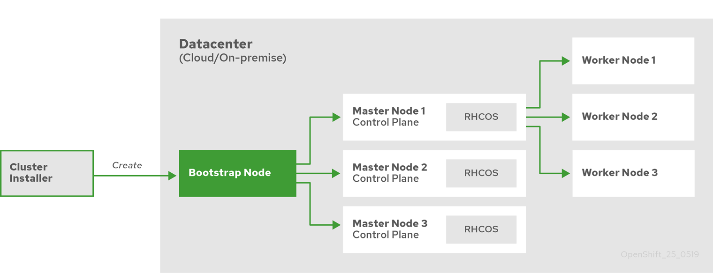

名词解释：
本文中所有描述的openshift4.1 或者ocp4.1 均表示 openshift container platform 4.1 即企业版。社区版4.1 暂未发布。

(RHCOS)  Red Hat Enterprise Linux CoreOS (RHCOS) 不需要提前下载系统，后面会在线拉取。

4.1版本


4.1部署方式和之前3.x完全不同，不适用于从3.x升级到4.1.


### 部署需求

#### 网络环境需求
必须联网！！！必须联网！！！必须联网！！！

将来是否提供离线安装暂未知。
1. 需要在线检查订阅。
2. 能够访问 quay.io 获取安装所需软件包。
3. 能够访问 OpenShift Infrastructure Providers 获取安装程序。

#### 配置需求
操作系统环境： 虚拟机（不含公有云，除非他能提供RHEL CoreOS），物理机。 即官方所说的UPI(user-provisioned infrastructure)或者bare metal。 虚拟机和物理机可以混合部署，提高资源利用率。  
备注： (IPI[Installer Provisioned Infrastructure]支持aws，但据悉还不支持中国区)

最小化集群安装所需节点：  
1台 基础服务节点，用于安装部署所需的dhcp，dns，ftp服务。系统不限。  
1台 负载均衡，用于负载master节点api及router，功能同3.x。这个服务现在需要自己部署。系统不限，也可用硬负载。  
1台 部署引导节点 Bootstrap，用于安装openshift集群，在集群安装完成后可以删除。系统RHCOS  
3台 控制节点 Control plane，即master，通常使用三台部署高可用，etcd也部署在上面。系统RHCOS  
不低于两台计算节点 Compute，用于运行openshift基础组件及应用 。RHCOS or RHEL 7.6  

官方推荐最低资源需求。落地的时候可以参考这个配置。
|Machine|Operating System|vCPU|RAM|Storage|
|-|-|-|-|-|
|Bootstrap|RHCOS|4|16GB|120 GB|
|Control plane|RHCOS|4|16 GB|120 GB|
|Compute|RHCOS or RHEL 7.6|2|8 GB|120 GB|
dns，dhcp，负载均衡等服务官网未做配置要求，可以用利用环境内已有服务进行配置。也可以全新部署。

这是本次测试实际使用及配置，测试环境资源有限，做了压缩。  
所有需要组件全新部署，包含dns，dhcp，ftp，负载均衡，运行在base0，系统centos7.5，方便在线装软件。 也可以使用RHEL7，通过订阅来安装软件。
**openshift集群节点统一使用RHCOS。注意系统不需要提前安装！！！会通过自动部署来安装。**  
|Machine|OS|vCPU|RAM|Storage|IP|
|-|-|-|-|-|-|
|base|centos7.5|2|4GB|40 GB|192.168.1.141|
|bootstrap0|RHCOS|2|2GB|40 GB|192.168.1.142|
|master0|RHCOS|2|8 GB|40 GB|192.168.1.143|
|master1|RHCOS|2|8 GB|40 GB|192.168.1.144|
|master2|RHCOS|2|8 GB|40 GB|192.168.1.145|
|infnode0|RHCOS|2|8 GB|40 GB|192.168.1.146|
|cptnode0|RHCOS|2|8 GB|40 GB|192.168.1.147|

###  部署安装
文档先放前面，如果在本文中你遇到了未描述到的问题，可以参阅以下文档。  
官方部署文档 
https://docs.openshift.com/container-platform/4.1/installing/installing_bare_metal/installing-bare-metal.html

参考文档  
https://blog.openshift.com/deploying-a-upi-environment-for-openshift-4-1-on-vms-and-bare-metal/

https://blog.openshift.com/openshift-4-bare-metal-install-quickstart/
官方安装诊断手册
Troubleshooting OpenShift Container Platform 4.x: UPI Installation  
https://access.redhat.com/articles/4292081

#### 安装流程概述



稍后补充，暂时还不清楚怎么玩。

#### 安装base0基础组件节点
|base|centos7.5|2|4GB|40 GB|192.168.1.141|
1. 安装系统 centos7.5 mini  
设置IP信息，DNS用8.8.8.8 和114.114.114.114
设置主机名，关闭防火墙和selinux
```bash
hostnamectl set-hostname base
sed -i 's/SELINUX=enforcing/SELINUX=disabled/g' /etc/selinux/config
setenforce 0
systemctl disable firewalld
systemctl stop firewalld

```
2. 设置 yum 缓存包到本地 - 可选步骤  
这样以后如果切换到离线安装，可以方便知道用了哪些包  
编辑 /etc/yum.conf 把keepcache改为1  
keepcache=1

3. 安装dnsmasq
通过dnsmasq 实现dns，dhcp，tftp
```bash
yum install dnsmasq syslinux -y
```
以下用到的 dns dhcp haproxy 配置文件都保存在这，供参考
https://github.com/cai11745/k8s-ocp-yaml/tree/master/ocp41

 4. DNS 配置

 bootstrap master node 分别把主机名指向各自ip

 api 和api-init 指向master api 6443端口的load balance，本环境lb 部署在base节点

 etcd0-2 部署在 master0-2 上，分别对应

用到了 A记录，SRV记录。 关于PTR记录反向解析，官网没有提到，暂不配置。

```bash
[root@base dnsmasq.d]# cat /etc/dnsmasq.d/dns-resolv.conf 
address=/bootstrap-0.ocp41sz.example.com/192.168.1.142
address=/master-0.ocp41sz.example.com/192.168.1.143
address=/master-1.ocp41sz.example.com/192.168.1.144
address=/master-2.ocp41sz.example.com/192.168.1.145
address=/infnode-0.ocp41sz.example.com/192.168.1.146
address=/cptnode-0.ocp41sz.example.com/192.168.1.147
# api & api-init should point to the load balancer for the control plane machines.
address=/api.ocp41sz.example.com/192.168.1.141
address=/api-int.ocp41sz.example.com/192.168.1.141

# etcd ipaddr set to master ipaddr
address=/etcd-0.ocp41sz.example.com/192.168.1.143
address=/etcd-1.ocp41sz.example.com/192.168.1.144
address=/etcd-2.ocp41sz.example.com/192.168.1.145

# A wildcard DNS record that points to the load balancer for the Ingress router pods.
address=/apps.ocp41sz.example.com/192.168.1.141

# For each control plane machine, OpenShift Container Platform also requires a SRV DNS record for \
# etcd server on that machine with priority 0, weight 10 and port 2380. 
# A cluster that uses three control plane machines requires the following records:
#srv-host=<_service>.<_prot>.[<domain>],[<target>[,<port>[,<priority>[,<weight>]]]]
srv-host=_etcd-server-ssl._tcp.ocp41sz.example.com,etcd-0.ocp41sz.example.com,2380,0,10
srv-host=_etcd-server-ssl._tcp.ocp41sz.example.com,etcd-1.ocp41sz.example.com,2380,0,10
srv-host=_etcd-server-ssl._tcp.ocp41sz.example.com,etcd-2.ocp41sz.example.com,2380,0,10

# _service._proto.name.                   TTL    class SRV priority weight port target.
#_etcd-server-ssl._tcp.ocp41sz.example.com  86400 IN    SRV 0        10     2380 etcd-0.ocp41sz.example.com.
#_etcd-server-ssl._tcp.ocp41sz.example.com  86400 IN    SRV 0        10     2380 etcd-1.ocp41sz.example.com.
#_etcd-server-ssl._tcp.ocp41sz.example.com  86400 IN    SRV 0        10     2380 etcd-2.ocp41sz.example.com.
```

启动dnsmasq
```bash
systemctl start dnsmasq
systemctl enable dnsmasq

# 测试正向解析. nslookup x.x.x.com dns-server-ip
yum install bind-utils -y
nslookup api-int.ocp41sz.example.com 192.168.1.141
nslookup etcd-2.ocp41sz.example.com 192.168.1.141

# 测试srv
host -t SRV _etcd-server-ssl._tcp.ocp41sz.example.com 192.168.1.141
```

5. DHCP 配置

dhcp-range 是dhcp的地址池，分别是起始地址和终止地址，掩码，租期
dhcp-option： 3 表示配置的是网关，6 表示配置的DNS server
dhcp-host 通过mac和IP绑定，能够让主机按照自己的预设获取地址，且不会导致IP分配给网络内其他主机。

```bash
[root@base dnsmasq.d]# cat /etc/dnsmasq.d/dhcp.conf 
# Start,Stop,Mask,Lease
dhcp-range=192.168.1.142,192.168.1.147,255.255.248.0,2h

# Set gateway as Router. Following two lines are identical.
#dhcp-option=option:router,192.168.1.1
dhcp-option=3,192.168.1.1

# Set DNS server.
dhcp-option=6,192.168.1.141

dhcp-host=00:50:56:a2:32:db,bootstrap-0.ocp41sz.example.com,192.168.1.142
dhcp-host=00:50:56:a2:0e:ff,master-0.ocp41sz.example.com,192.168.1.143
dhcp-host=00:50:56:a2:51:09,master-1.ocp41sz.example.com,192.168.1.144
dhcp-host=00:50:56:a2:09:bf,master-2.ocp41sz.example.com,192.168.1.145
dhcp-host=00:50:56:a2:11:a9,infnode-0.ocp41sz.example.com,192.168.1.146
dhcp-host=00:50:56:a2:41:f6,cptnode-0.ocp41sz.example.com,192.168.1.147

```

6. 配置PXE和tftp

```bash
# 创建tftp的目录
mkdir /var/lib/tftp

# 拷贝pxe的启动文件pxelinux.0
cp /usr/share/syslinux/pxelinux.0 /var/lib/tftp/

[root@base dnsmasq.d]# cat tftp.conf 
enable-tftp    ##打开tftp功能##
dhcp-boot=pxelinux/pxelinux.0
tftp-root=/var/lib/tftp   ##指定tftp目录##
dhcp-boot=pxelinux.0     ##对应/var/lib/tftp/pxelinux.0 ##
```


